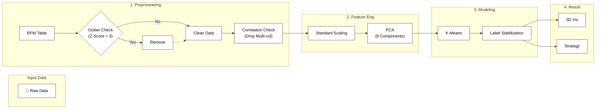

## 아키텍처


## 1. 프로젝트 개요
고객의 구매 데이터(User Data)를 기반으로 **RFM(Recency, Frequency, Monetary)** 분석과 **K-Means 클러스터링**을 수행하여 고객을 세분화하고, 이를 바탕으로 데이터 기반의 마케팅 전략을 수립한 프로젝트입니다.

- **진행 기간:** 202X.XX ~ 202X.XX
- **주요 역할:** 데이터 전처리, 이상치 탐지, 차원 축소(PCA), 군집화 모델링, 시각화
- **사용 언어 및 툴:** Python, Pandas, Scikit-learn, Seaborn, Plotly

---

## 2. 문제 정의 (Problem)
**"더티 데이터와 고차원의 저주로 인한 분석 신뢰성 저하"**

1. **데이터 신뢰성 문제 (GIGO):** 수집된 데이터 내에 비정상적인 구매 패턴(이상치)이 포함되어 있어, 전체 평균을 왜곡하고 군집화 성능을 저하시킬 위험이 있었습니다.
2. **다중공선성 및 연산 효율성:** `total_transactions`와 `unique_products` 간의 상관계수가 0.95에 달하는 등 변수 간 중복성이 높았고, 특성(Feature)이 많아 시각적 분석이 불가능했습니다.
3. **단순 분류의 한계:** 기존의 규칙 기반 RFM 분류로는 데이터 내의 복합적인 패턴을 발견하기 어려웠습니다.

---

## 3. 해결 과정 (Solution)
**"통계적 전처리와 PCA를 활용한 모델 최적화"**

### 3-1. 이상치 제거 (Outlier Detection)
- **Z-Score 활용:** 데이터 왜곡 방지를 위해 표준화(Standardization) 후, Z-Score 임계값(Threshold)을 **3**으로 설정했습니다.
- **결과:** 전체 데이터의 약 **6%**에 해당하는 통계적 이상치를 제거하여 분석 품질을 확보했습니다.

### 3-2. 차원 축소 (PCA)
- **다중공선성 해결:** 상관관계 히트맵 분석 후, 정보 손실을 최소화하며 차원을 줄이기 위해 PCA를 적용했습니다.
- **Elbow Point 선정:** 설명 분산(Explained Variance) 비율이 둔화되는 지점을 찾아 **6개의 주성분(PC)**을 최종 특성으로 선정했습니다.

### 3-3. K-Means 클러스터링 최적화
- **레이블 고정 로직 구현:** K-Means(K=3) 실행 시마다 군집 레이블이 변경되는 문제를 해결하기 위해, 군집별 빈도수를 기반으로 레이블을 매핑하는 로직을 추가하여 모델의 일관성을 확보했습니다.

---

## 4. 분석 결과 (Result)
**"명확한 3개의 고객 군집 도출"**

- **시각화:** PCA를 통해 2차원/3차원으로 차원 축소 후 시각화한 결과, 군집 간 경계가 뚜렷하게 분리됨을 확인했습니다.
- **세그먼테이션:** 전체 고객을 성격이 뚜렷한 3개 그룹으로 분류했습니다.
  - **Group 0 (2,906명):** [이 그룹의 특징 요약, 예: 일반 대중 고객]
  - **Group 1 (632명):** [이 그룹의 특징 요약, 예: 충성도가 높은 VIP]
  - **Group 2 (541명):** [이 그룹의 특징 요약, 예: 이탈 위험군]
- **비즈니스 기여:** 각 군집별 맞춤형 프로모션 전략 수립이 가능해졌습니다.

<p align="center">
  
  <br>
  <em>[그림] PCA 기반 3D 클러스터링 시각화 결과</em>
</p>

---

## 5. 핵심 코드 (Code Snippets)

### 이상치 제거 (Z-Score)
```python
from scipy import stats
import numpy as np

# Z-score 계산 및 임계값(3) 설정
z_scores = np.abs(stats.zscore(user_data.iloc[:, 1:]))
user_data = user_data[(z_scores < 3).all(axis=1)]
