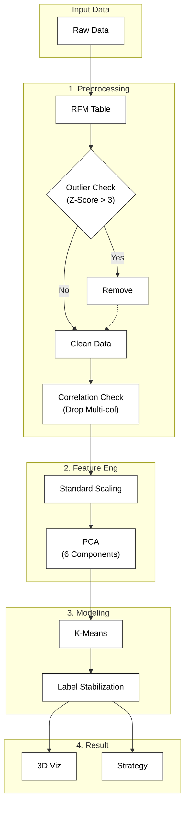

## outline
고객의 구매 데이터(User Data)를 기반으로 **RFM(Recency, Frequency, Monetary)** 분석과 **K-Means 클러스터링**을 수행하여 고객을 세분화하고, 이를 바탕으로 데이터 기반의 마케팅 전략을 수립

- **진행 기간:** 2025.11.27 ~ 2025.11.28
- **주요 역할:** 데이터 전처리, 이상치 탐지, 차원 축소(PCA), 군집화 모델링, 시각화
- **사용 언어 및 툴:** Python, Pandas, Scikit-learn, Seaborn, Plotly
---
## Architecture

---

## Data Pipeline (SQL)

분석에 사용된 `user_data`는 원본 트랜잭션 DB에서 바로 추출한 것이 아니라, Google BigQuery(SQL)를 활용하여 정제 및 피처 엔지니어링 과정을 거쳐 생성
*(상세 쿼리는 `sql/` 디렉토리에서 확인 가능)*

**1. Data Cleaning (`sql/1_data_cleaning.sql`)**
- `REGEXP`를 활용한 비정상 StockCode 탐지 및 제거
- `GROUP BY`와 `DISTINCT`를 활용하여 중복 데이터 및 결측치(Null) 제거

**2. Feature Engineering (`sql/2_create_features.sql`)**
- 단순 집계가 아닌 `Window Functions(LAG, OVER)`를 사용하여 *'평균 구매 주기'*와 같은 시계열 파생 변수 생성
- 가독성과 유지보수성을 위해 `WITH` 절을 사용하여 단계별로 RFM 및 취소율(Cancel Rate) 지표 집계

---

## Problem

**"더티 데이터와 고차원의 저주로 인한 분석 신뢰성 저하"**

1. 수집된 데이터 내에 비정상적인 구매 패턴(이상치)이 포함되어 있어, 전체 평균을 왜곡하고 군집화 성능을 저하시킬 위험 존재

2. `total_transactions`와 `unique_products` 간의 상관계수가 0.95에 달하는 등 변수 간 중복성이 높았고, 특성(Feature)이 많아 시각적 분석이 불가능하다고 판단

3. 기존의 규칙 기반 RFM 분류로는 데이터 내의 복합적인 패턴을 발견하기 어려움

---

## Solution
**"통계적 전처리와 PCA를 활용한 모델 최적화"**

### Outlier Detection

  
   
  <em>[figure1] 93.51%의 데이터가 정상치(0)으로 라벨링</em>

- 데이터 왜곡 방지를 위해 표준화(Standardization) 후, Z-Score 임계값(Threshold)을 **3**으로 설정
- 전체 데이터의 약 **6%**에 해당하는 통계적 이상치를 제거하여 분석 품질을 확보

### PCA

  
   
  <em>[figure2] PCA - Elbow point 탐색</em>

- 상관관계 히트맵 분석 후, 정보 손실을 최소화하며 차원을 줄이기 위해 PCA를 적용
- 설명 분산(Explained Variance) 비율이 둔화되는 지점(Elbow Point)을 찾아 **6개의 주성분(PC)**을 최종 특성으로 선정

### K-Means Clustering Optimization 

- K-Means(K=3) 실행 시마다 군집 레이블이 변경되는 문제를 해결하기 위해, 군집별 빈도수를 기반으로 레이블을 매핑하는 로직을 추가하여 모델의 일관성 확보

---

## Result
**"명확한 3개의 고객 군집 도출"**

- PCA를 통해 2차원/3차원으로 차원 축소 후 시각화한 결과, 군집 간 경계가 뚜렷하게 분리됨을 확인
  
- 전체 고객을 성격이 뚜렷한 3개 그룹으로 분류
  - **Group 0 (2,906명)
  - **Group 1 (632명)
  - **Group 2 (541명)

- 세그먼테이션을 통해 맞춤형 프로모션 전략 수립 가능 

  
   
  <em>[그림] PCA 기반 3D 클러스터링 시각화 결과</em>

---
